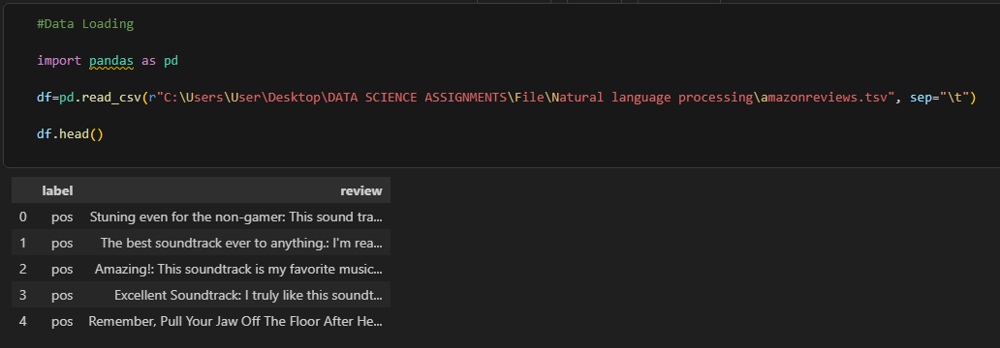
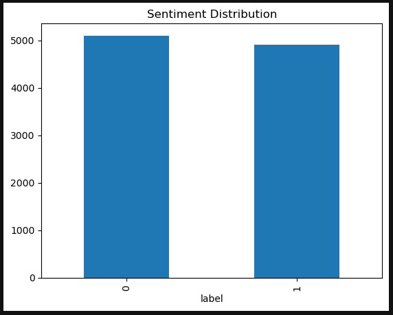
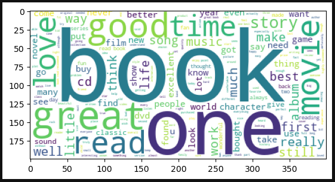
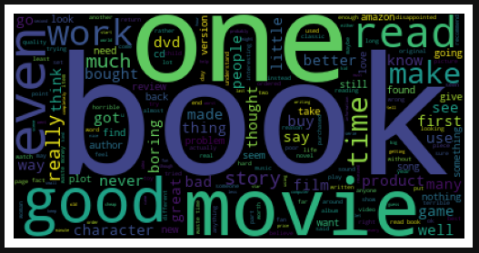
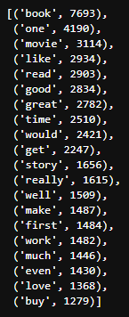
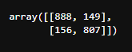
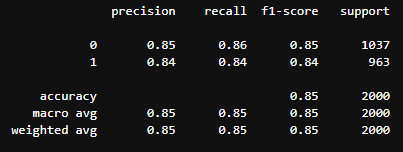
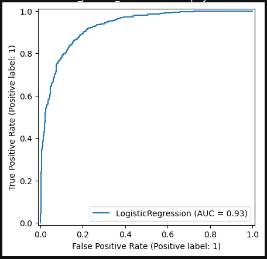

# 😊 Amazon Customer Review Sentiment Analysis

<p align="center">


</p>

---

# 📌 Project Overview

This project develops an **Automated Sentiment Analysis System** to classify Amazon customer reviews as **Positive** or **Negative** using **Natural Language Processing (NLP)** and **Machine Learning**.

The solution helps e-commerce businesses automatically analyze customer feedback, identify products receiving negative reviews, and improve customer satisfaction by enabling faster responses to customer complaints.

The project covers the complete NLP pipeline including data cleaning, text preprocessing, exploratory data analysis, feature engineering, model development, and performance evaluation.

---

# 💼 Business Problem

E-commerce platforms receive thousands of customer reviews every day. While product ratings provide useful information, they do not always reflect the actual sentiment expressed in customer reviews.

This project aims to build an automated sentiment classification model that helps businesses:

- Monitor customer satisfaction in real time
- Detect products receiving negative feedback
- Improve customer support efficiency
- Analyze customer opinions at scale
- Support data-driven business decisions

---

# 🎯 Project Objectives

- Clean and preprocess customer review text
- Perform exploratory data analysis
- Generate Word Clouds for positive and negative reviews
- Extract text features using TF-IDF
- Train Machine Learning classification models
- Compare model performance
- Evaluate model accuracy using classification metrics

---

# 🛠 Tools & Technologies

| Tool | Purpose |
|------|---------|
| Python | Programming Language |
| Pandas | Data Manipulation |
| NumPy | Numerical Computing |
| Matplotlib | Data Visualization |
| Scikit-learn | Machine Learning |
| NLTK | Natural Language Processing |
| TF-IDF | Feature Extraction |
| Jupyter Notebook | Development Environment |

---

# 📊 Project Workflow

### 📥 Data Collection

- Amazon Customer Reviews Dataset
- 10,000 labeled reviews

### 🧹 Data Cleaning

- Removed duplicate reviews
- Checked missing values
- Converted text to lowercase
- Removed punctuation
- Removed stopwords

### 📈 Exploratory Data Analysis

- Dataset Overview
- Sentiment Distribution
- Positive Word Cloud
- Negative Word Cloud
- Most Frequent Words

### ⚙ Feature Engineering

- TF-IDF Vectorization

### 🤖 Machine Learning Models

- Logistic Regression
- Support Vector Machine (SVM)
- Naive Bayes

### 📊 Model Evaluation

- Accuracy
- Precision
- Recall
- F1-Score
- Confusion Matrix
- ROC Curve

---

# 📷 Project Screenshots

## Dataset Preview



---

## Sentiment Distribution



---

## Positive Word Cloud



---

## Negative Word Cloud



---

## Most Frequent Words



---

## Confusion Matrix



---

## Classification Report



---

## ROC Curve



---

# 📈 Model Performance

The trained Machine Learning models were evaluated using standard classification metrics.

### Evaluation Metrics

- Accuracy
- Precision
- Recall
- F1-Score
- Confusion Matrix
- ROC-AUC

---

# 💡 Key Insights

- Successfully classified customer reviews into Positive and Negative sentiments.
- TF-IDF effectively transformed text into numerical features for machine learning.
- Word Clouds highlighted the most frequently used positive and negative terms.
- The classification model demonstrated strong predictive performance.
- Automated sentiment analysis enables businesses to monitor customer satisfaction efficiently.

---

# 📚 Skills Demonstrated

- Python Programming
- Natural Language Processing (NLP)
- Text Cleaning
- Text Preprocessing
- TF-IDF Vectorization
- Exploratory Data Analysis (EDA)
- Data Visualization
- Machine Learning
- Logistic Regression
- Support Vector Machine (SVM)
- Naive Bayes
- Model Evaluation
- Scikit-learn

---

# 📁 Dataset

This project uses an **Amazon Customer Reviews Dataset** containing **10,000 labeled customer reviews**.

### Dataset Information

| Feature | Description |
|---------|-------------|
| Reviews | 10,000 |
| Labels | Positive / Negative |
| Target Variable | Sentiment |
| Format | CSV |

### Dataset Columns

| Column | Description |
|---------|-------------|
| label | Review Sentiment (Positive / Negative) |
| review | Customer Review Text |

📥 **Download Dataset**

```text
Dataset.csv
```

---

# 📂 Repository Structure

```text
Amazon-Customer-Review-Sentiment-Analysis
│
├── Dataset.csv
├── NLP.ipynb
├── README.md
├── requirements.txt
│
├── dataset-preview.png
├── class-distribution.png
├── positive-wordcloud.png
├── negative-wordcloud.png
├── most-frequent-words.png
├── confusion-matrix.png
├── classification-report.png
└── roc-curve.png
```

---

# 🚀 How to Run

1. Clone this repository.
2. Install the required Python libraries.

```bash
pip install -r requirements.txt
```

3. Open the Jupyter Notebook.

```text
NLP.ipynb
```

4. Run all notebook cells.

---

# 👨‍💻 Author

**Khushal Panchal**

Data Analyst | SQL | Excel | Power BI | Tableau | Python | Machine Learning

### Connect with Me

- LinkedIn: https://www.linkedin.com/in/khushal-panchal-4b629324a
- GitHub: https://github.com/KPanchal69

---

⭐ If you found this project useful, consider giving it a star!
